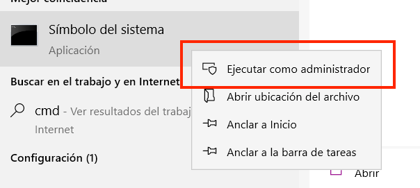
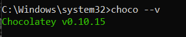
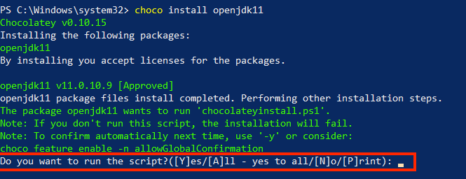
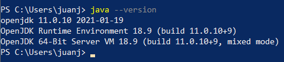

# Requerimientos

> Antes de nada, recomiendo desinstalar todas las versiones anteriores de JAVA y de Netbeans que tengas instalado en tu PC.

## Java
Utilizaremos la versión de `Java 14` en su versión `OpenJDK`
### Instalación en Windows

> En caso de tener versiones anteriores de Java instaladas te recomiendo instalar un gestor de versiones de Java, puedes encontrar una guía [aquí](https://superuser.com/questions/1057532/how-to-change-java-version-on-windows-10).

Para evitar problemas, recomiendo utilizar un **gestor de paquetes** para la instalación de cualquier versión de Java, así se evitan muchos problemas.
En esta ocación mostraré como instalar `OpenJDK 14` con el uso de `CHOCOLATEY`

> Puedes saber más de CHOCOLATEY consultando su [página web](https://chocolatey.org/)

El requisito fundamental para instalar `CHOCOLATEY` es tener instalado **Microsoft .NET Framework 4+**, es muy probable que ya lo tengas instalado, pero puedes volverlo a instalar sin problemas, solo debes descargarlo desde [la página oficial de Microsoft](https://www.microsoft.com/es-es/download/details.aspx?id=17851) y abrir el instalador.

Ahora si, los pasos para instalar `CHOCOLATEY` son:
1. Abrir un terminal en modo administrador, debe ser realizado este proceso con **CMD**

    

2. Ahora copiamos y pegamos el siguiente comando:
    ```
    @"%SystemRoot%\System32\WindowsPowerShell\v1.0\powershell.exe" -NoProfile -InputFormat None -ExecutionPolicy Bypass -Command "[System.Net.ServicePointManager]::SecurityProtocol = 3072; iex ((New-Object System.Net.WebClient).DownloadString('https://chocolatey.org/install.ps1'))" && SET "PATH=%PATH%;%ALLUSERSPROFILE%\chocolatey\bin"
    ```
    Y presionamos Enter.
   De esta forma comenzará la instalación de `CHOCOLATEY`
   
3. Una vez finalizado el paso anterior procedemos a comprobar si la instalación fue exitosa, podemos abrir una nueva ventana de CMD y ejecutar el comando `choco --v` y deberá aprecer la versión instalada en el sistema

    
   
    En caso de tener errores, revisar la versión de .NET que tengas instalada en tu PC y vuelve a intentarlo de nuevo.

Listo, hasta ahora solo instalamos el gestor de paquetes, ahora si podemos instalar el OpenJDK 11, para ello solo es necesario ejecutar el comando en un CMD con privilegios de administrador:
```
choco install openjdk14
```
Aceptamos los términos y condiciones



Por último comprobamos que se ha instalado correctamente ejecutando el comando `java --version` en una nueva instancia de CMD



Debe notarse que la versión de Java debe ser en la versión 11.
### Instalación en Linux
Solo se debe ejecutar el comando:
```
sudo apt-get install openjdk-14-jdk
```

## Apache NetBeans 12 LTS
> Es importante que tengas descargada la misma versión de Apache Netbeans para evitar problemas

Links de descarga:
- [Link de descarga para Windows](https://apache.ups.edu.ec/dist/netbeans/netbeans/12.0/Apache-NetBeans-12.0-bin-windows-x64.exe)
- [Link de descarga para Linux](https://apache.ups.edu.ec/dist/netbeans/netbeans/12.0/Apache-NetBeans-12.0-bin-linux-x64.sh])
- [Link de descarga para MacOs](https://apache.ups.edu.ec/dist/netbeans/netbeans/12.0/Apache-NetBeans-12.0-bin-macosx.dmg)
