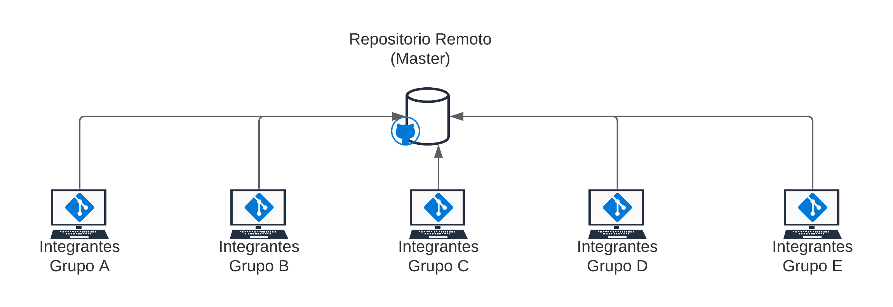
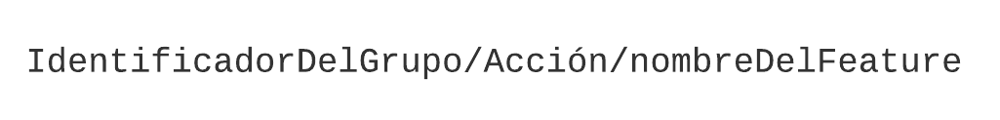

# Git Workflow
## Propósito
Este documento contiene el esquema principal y las tecnologías con el que se trabajará el manejo de versiones del proyecto

## Gestión de repositorios
Se utilizará git para el control de versiones locales y Github para mantener el repositorio remoto.

La estructura que se utilizará es la de un mono-repo

## Nombramiento de ramas

Dado que se debe distribuir el trabajo entre diferentes grupos se utilizaran ramas para la gestión de los cambios.
El nombramiento de cada rama debe seguir la siguiente estructura:

En dónde:
* **Identificador del Grupo** 
  
    Corresponde a la letra asignada al grupo. Ej: A, B, C ...
* **Acción** 
  
    Representa a la intención de creación de la rama, puede ser: 
  * `create`
    
    Representa la creación de un feature (_módulo, clase, etc..._) para su implementación
  * `fix`
    
    Representa una rama que se creó para arreglar un bug específico, una vez que el bug se arregla, la rama se deja de usar
    
  * `release`
    
    > Esta acción no depende de un `Identificador de Grupo`, solo de la acción y la versión del release    

    Representa a las ramas que contienen una versión optimizada para producción del código
    
* **Nombre del Feature**
  
    Representa el nombre de la clase, módulo o parte del proyecto que se implementa en esa rama.
  
Un par de ejemplos de ramas que aplican este estándar pueden ser los siguientes:
* `c/create/users`
* `b/create/gestor-de-paquetes`
* `e/create/solicitud-de-mantenimiento`
* `a/fix/users-no-almacena-en-bd`
* `release/v1.0`
* `release/v2.0`

> Como se observa, la separación de las partes del estándar de nombramiento de las ramas se separa con el símbolo: '`/`'
